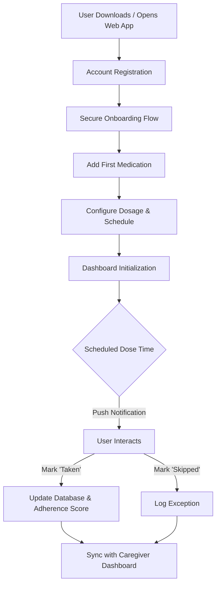
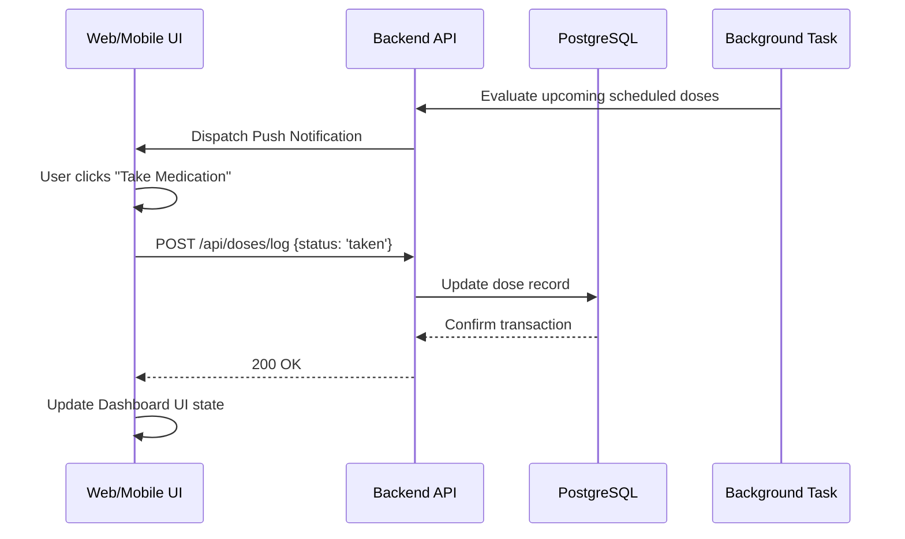
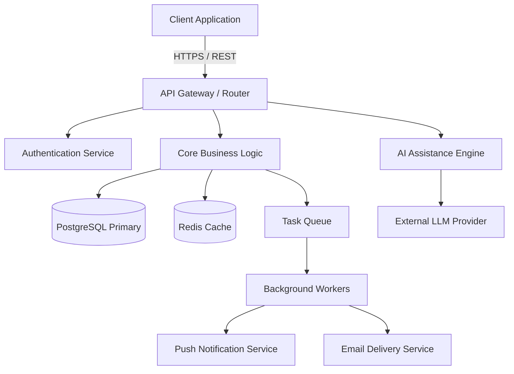

# DoseLoop: The Official Project Bible

<details>
<summary>Table of Contents</summary>

- [1. Executive Summary](#1-executive-summary)
- [2. Vision](#2-vision)
- [3. Mission](#3-mission)
- [4. Product Philosophy](#4-product-philosophy)
- [5. Problem Statement](#5-problem-statement)
- [6. Our Solution](#6-our-solution)
- [7. Target Audience](#7-target-audience)
- [8. Market Research](#8-market-research)
- [9. Competitor Analysis](#9-competitor-analysis)
- [10. Unique Selling Proposition](#10-unique-selling-proposition)
- [11. Core Features (Current Version)](#11-core-features-current-version)
- [12. User Journey](#12-user-journey)
- [13. Application Workflow](#13-application-workflow)
- [14. AI Assistant](#14-ai-assistant)
- [15. AI Limitations](#15-ai-limitations)
- [16. Technology Stack](#16-technology-stack)
- [17. Project Architecture](#17-project-architecture)
- [18. Folder Structure](#18-folder-structure)
- [19. Database Overview](#19-database-overview)
- [20. REST API Overview](#20-rest-api-overview)
- [21. Authentication Flow](#21-authentication-flow)
- [22. Notification System](#22-notification-system)
- [23. Email System](#23-email-system)
- [24. Security Philosophy](#24-security-philosophy)
- [25. Performance Goals](#25-performance-goals)
- [26. UI / UX Design Principles](#26-ui--ux-design-principles)
- [27. Accessibility](#27-accessibility)
- [28. Development Workflow](#28-development-workflow)
- [29. Coding Standards](#29-coding-standards)
- [30. Git Workflow](#30-git-workflow)
- [31. Testing Strategy](#31-testing-strategy)
- [32. Deployment Strategy](#32-deployment-strategy)
- [33. Product Roadmap](#33-product-roadmap)
- [34. Known Limitations](#34-known-limitations)
- [35. Future Vision](#35-future-vision)
- [36. Glossary](#36-glossary)
- [37. Conclusion](#37-conclusion)
</details>

---

## 1. Executive Summary

DoseLoop is an AI-powered, privacy-first family health companion. Engineered to surpass the capabilities of traditional utility applications, it provides a comprehensive digital infrastructure for managing medications, fostering healthy routines, and coordinating caregiver support. By abstracting the complexity of medical scheduling into an intuitive, beautifully designed interface, DoseLoop empowers users to achieve high medication adherence while providing real-time visibility and peace of mind to their support networks.

---

## 2. Vision

To establish the definitive digital health infrastructure for households globally, seamlessly integrating patients, families, and actionable AI intelligence into a secure, unified care ecosystem.

---

## 3. Mission

To empower individuals to confidently manage their medication regimens while enabling families to collaborate in daily care through intelligent, secure, and user-centric technology.

---

## 4. Product Philosophy

> "Help people take the right medicine, at the right time, while empowering families to care for each other through intelligent, secure, and beautifully designed technology."

DoseLoop is fundamentally collaborative. Traditional medication tools fail because they isolate the patient, treating health management as a solitary burden. Our philosophy dictates that technology must reduce cognitive load, adapt to human behavior, and proactively integrate the patient's support network. We are building a premium healthcare companion, not just an alarm clock.

---

## 5. Problem Statement

The current paradigm of personal and family health management is fragmented and error-prone, resulting in several systemic challenges:

* **Medication Adherence:** Poor adherence leads to severe health complications, hospital readmissions, and increased healthcare costs.
* **Elderly Care Vulnerabilities:** Seniors frequently struggle with complex, evolving medication regimens and lack immediate, non-intrusive oversight from family members.
* **Chronic Illness Management:** Patients managing chronic conditions face significant cognitive overhead tracking varying schedules, dosages, and symptom correlations.
* **Family Care Disconnection:** Caregivers lack a centralized, real-time mechanism to monitor the health routines of dependents, often relying on text messages or memory.
* **Caregiver Miscommunication:** Decentralized tracking often results in dangerous scenarios, such as accidental double-dosing when multiple caregivers are involved.
* **Reminder Fatigue:** Applications that rely on constant, undifferentiated push notifications condition users to dismiss alerts automatically, neutralizing their effectiveness.
* **Scattered Health Information:** Critical data—prescriptions, provider contacts, and adherence histories—is distributed across disparate physical notes and generic digital apps.

---

## 6. Our Solution

DoseLoop resolves these critical pain points through a unified architectural approach:

* **Intelligent Reminder Engine:** Delivers context-aware notifications designed to prevent fatigue, adapting to user response patterns.
* **Collaborative Caregiver Hub:** Implements a real-time synchronization layer that securely shares adherence status with permitted family members, preventing miscommunication.
* **Centralized Health Dashboard:** Consolidates complete medication regimens, refill timelines, and actionable insights into a single, highly accessible interface.
* **AI-Assisted Context:** Provides on-demand, verifiable information regarding medication schedules and platform usage, dramatically reducing user confusion.

---

## 7. Target Audience

DoseLoop is engineered for several primary user personas, each with distinct needs:

* **Elderly Users:** Require highly accessible interfaces, large typography, and streamlined workflows.
* **Family Caregivers:** Need real-time status monitoring, alert escalation mechanisms, and comprehensive historical logs.
* **Patients with Chronic Diseases:** Require support for complex scheduling architectures (e.g., tapering doses, as-needed medications).
* **Busy Professionals:** Value frictionless data entry, actionable notifications, and integration into existing daily routines.
* **Parents:** Manage pediatric dosages, short-term prescriptions (like antibiotics), and immunization records.
* **Students & Young Adults:** Often managing first-time independent healthcare responsibilities; benefit from educational UI elements and low-friction onboarding.

---

## 8. Market Research

The digital health sector is experiencing a paradigm shift from isolated, single-use utility applications to holistic wellness platforms. 

* **Market Gaps:** Existing solutions lack true multi-user collaborative care environments. They often suffer from poor UX/UI, leading to high abandonment rates within the first 30 days.
* **Industry Trends:** There is an accelerating demand for privacy-first AI tools in healthcare, alongside the needs of aging populations requiring remote, non-invasive monitoring.
* **User Expectations:** The "consumerization of healthcare" dictates that users expect the same tier of design polish, responsiveness, and reliability from their health tools as they do from top-tier consumer applications (e.g., Apple, Notion).

---

## 9. Competitor Analysis

| Competitor | Core Focus | Strengths | Weaknesses | DoseLoop Differentiation |
|---|---|---|---|---|
| **Medisafe** | Reminders | Established user base; extensive database. | Cluttered interface; ad-heavy free tier. | Clean, premium UX; privacy-first architecture; deep family integration. |
| **MyTherapy** | General Tracking | Simple interface; broad tracking. | Limited caregiver roles; minimal AI integration. | Specialized medication focus; advanced caregiver collaboration capabilities. |
| **CareClinic** | Comprehensive Data | Highly customizable; vast feature set. | Overwhelming for average users; steep learning curve. | Intuitive onboarding; progressive disclosure of advanced features. |
| **Apple Health** | OS Integration | Frictionless for iOS users; highly secure. | Ecosystem lock-in; limited multi-user sharing. | Cross-platform availability; purpose-built collaborative tools. |

---

## 10. Unique Selling Proposition

DoseLoop is the only medication management platform architected around the family unit as the primary stakeholder. We merge enterprise-grade security and state-of-the-art AI assistance with a consumer-grade, aesthetically premium user experience. It is built to be a tool users trust implicitly and enjoy interacting with daily.

---

## 11. Core Features (Current Version)

### Medication Management
* **Purpose:** Centralize all active and historical prescriptions.
* **Benefits:** Eliminates ambiguity regarding current regimens and serves as a single source of truth.
* **Expected Workflow:** Users manually input medication parameters (name, dosage, frequency). The system calculates required daily intake and projects supply depletion.

### Reminder System
* **Purpose:** Ensure precise, timely medication consumption.
* **Benefits:** Directly increases adherence rates through reliable notifications.
* **Expected Workflow:** Background services trigger notifications based on predefined schedules. Users can interactively mark doses as taken, skipped, or snoozed directly from the alert.

### Family & Caregiver
* **Purpose:** Enable shared responsibility for health maintenance.
* **Benefits:** Provides critical peace of mind to remote caregivers and actively prevents double-dosing.
* **Expected Workflow:** The primary user generates a secure invitation link. The caregiver accepts and receives customized access (read-only or managed) to the primary user's dashboard.

### Dashboard
* **Purpose:** Provide an immediate, at-a-glance view of daily requirements.
* **Benefits:** Minimizes cognitive load and prioritizes immediate necessary actions.
* **Expected Workflow:** Upon authentication, users view today's timeline, pending medications, and a top-level adherence metric.

### Notifications
* **Purpose:** Deliver timely updates across optimal channels.
* **Benefits:** Keeps users and caregivers informed of critical events asynchronously.
* **Expected Workflow:** Push notifications for immediate dose alerts; email summaries for weekly adherence overviews.

### Authentication
* **Purpose:** Secure identity management and data access.
* **Benefits:** Protects highly sensitive Personal Health Information (PHI).
* **Expected Workflow:** Standard secure email/password or OAuth-based login with robust session management.

### Settings
* **Purpose:** Allow customization of the application experience.
* **Benefits:** Accommodates individual preferences for notification sounds, timezones, and display modes.
* **Expected Workflow:** Dedicated UI panel for user preference configuration.

### Reports
* **Purpose:** Generate summaries of adherence and health tracking.
* **Benefits:** Provides a communicable record of health patterns for users and their medical providers.
* **Expected Workflow:** User selects a date range and clicks "Export," generating a secure summary.

### Accessibility
* **Purpose:** Ensure the platform is usable by all individuals, regardless of physical or cognitive impairments.
* **Benefits:** Broadens user base to elderly and disabled populations.
* **Expected Workflow:** High-contrast modes and screen reader support are enabled by default or via simple toggles.

### Analytics
* **Purpose:** Process adherence data to derive meaningful insights.
* **Benefits:** Highlights trends and potential areas for routine improvement.
* **Expected Workflow:** Dashboards display dynamic charts comparing adherence metrics over time.

### AI
* **Purpose:** Provide immediate, contextual assistance within the application.
* **Benefits:** Decreases user confusion and increases feature adoption without human intervention.
* **Expected Workflow:** User queries the assistant; the system returns verifiable, context-aware information.

---

## 12. User Journey



---

## 13. Application Workflow



---

## 14. AI Assistant

* **Purpose:** To provide highly contextual, on-demand information regarding medication routines and to simplify platform navigation.
* **Capabilities:** Answers queries about the user's current regimen, explains application features, and summarizes adherence trends.
* **Responsibilities:** Accurately parse user intent and deliver safe, verifiable, and strictly informational responses.
* **Workflow:** The user submits a natural language query. The AI processes the request against the user's specific state (RAG context), formats a response, and prepends explicit medical disclaimers.
* **Context Awareness:** The AI is strictly aware of the data explicitly entered into DoseLoop (e.g., active medications). It does not infer undocumented medical conditions.
* **Privacy Principles:** Interactions are processed securely. No Personally Identifiable Information (PII) is utilized to train generalized external models.
* **Safety Boundaries:** All health-related responses include a strict disclaimer that the AI is informational and does not constitute medical advice.

---

## 15. AI Limitations

> [!CAUTION]
> The DoseLoop AI operates strictly within predefined informational boundaries to ensure user safety.

* **No Diagnosis:** The AI will never attempt to diagnose a user or correlate symptoms to a specific disease.
* **No Prescription Changes:** The AI will never recommend altering a prescribed dosage, frequency, or stopping a medication.
* **No Emergency Medical Decisions:** In scenarios implying a medical crisis, the AI is programmed to immediately direct the user to contact emergency services (e.g., 911).
* **No Replacement for Professionals:** The system defers to certified medical practitioners for all clinical decisions.
* **No Fabricated Information:** Hallucination mitigation protocols are enforced to ensure the AI relies solely on vetted logic.

---

## 16. Technology Stack

| Domain | Technology | Rationale |
|---|---|---|
| **Frontend** | React (Vite/Next.js) | Component reusability, high performance, and an extensive ecosystem for rapid iteration. |
| **Styling** | Tailwind CSS / Radix UI | Utility-first styling for consistent design systems and robust accessibility primitives. |
| **Backend** | Node.js (TypeScript) | Unified language across the stack; exceptional performance for asynchronous I/O operations. |
| **Database** | PostgreSQL | Uncompromising relational integrity, ACID compliance, and JSONB support for flexible schemas. |
| **ORM** | Prisma / Drizzle | Type-safe database access, automated migrations, and developer velocity. |
| **Authentication** | Auth0 / Supabase | Secure, standard-compliant identity management offloading cryptographic risk. |
| **Email** | SendGrid / Resend | Reliable delivery of critical platform communications and onboarding flows. |
| **Notifications** | Firebase Cloud Messaging (FCM) | Cross-platform delivery of urgent, real-time push notifications. |
| **State Management** | Zustand & React Query | Lightweight client state combined with robust server state caching and synchronization. |
| **AI Integration** | OpenAI API / Anthropic | State-of-the-art LLM capabilities for processing contextual user assistance. |
| **Deployment (planned)** | Vercel (Client) / Render (API) | Managed, scalable infrastructure reducing DevOps overhead for initial launch. |
| **Monitoring (planned)** | Sentry / Datadog | Real-time error tracking and performance profiling to ensure platform stability. |
| **Analytics (planned)** | PostHog / Mixpanel | Product analytics to understand user behavior and optimize the user journey. |

---

## 17. Project Architecture



---

## 18. Folder Structure

```text
DOSELOOP/
├── client/                 # Frontend application workspace
│   ├── src/
│   │   ├── components/     # Reusable UI elements (Buttons, Cards, Modals)
│   │   ├── hooks/          # Custom React hooks (e.g., useAuth, useMedications)
│   │   ├── pages/          # Top-level route components
│   │   ├── services/       # API interaction and fetch logic
│   │   ├── store/          # Global state definitions
│   │   └── utils/          # Formatting and helper functions
├── server/                 # Backend application workspace
│   ├── src/
│   │   ├── controllers/    # Request/Response handlers
│   │   ├── models/         # Database schemas and entity definitions
│   │   ├── routes/         # Express/Router API definitions
│   │   ├── services/       # Core business logic
│   │   └── utils/          # Shared backend utilities
├── docs/                   # Architecture and technical documentation
└── assets/                 # Static assets, branding, and media
```

---

## 19. Database Overview

* **Users:** The core identity entity holding authentication references, profile data, and roles.
* **Medications:** A normalized dictionary of standard medications (acting as a reference table).
* **Prescriptions:** The junction entity linking a `User` to a `Medication`, containing dosage, frequency, and duration logic.
* **DoseLogs:** The transactional ledger recording individual medication events (scheduled time, actual time taken, status: taken/skipped/snoozed).
* **FamilyLinks:** The relationship matrix managing permissions between primary users and caregivers.

---

## 20. REST API Overview

* `/api/v1/auth`: Manages the authentication lifecycle (login, registration, token refresh, password recovery).
* `/api/v1/users`: Handles retrieval and modification of user profiles and application preferences.
* `/api/v1/prescriptions`: Provides CRUD operations for establishing and modifying medication regimens.
* `/api/v1/doses`: Dedicated endpoints for mutating daily adherence logs (marking doses as complete or missed) and querying historical timelines.
* `/api/v1/family`: Orchestrates caregiver invitations, permission modifications, and linked-account data retrieval.
* `/api/v1/ai`: Secure proxy endpoints for submitting queries to the AI assistant.

---

## 21. Authentication Flow

1. The client submits credentials to `/api/v1/auth/login`.
2. The server validates the payload against the secure database.
3. Upon success, the server issues a short-lived JSON Web Token (Access Token) and a secure, HttpOnly Refresh Token.
4. The client stores the Access Token in memory and attaches it as a Bearer token in the `Authorization` header for subsequent API requests.
5. When the Access Token expires, the client silently utilizes the Refresh Token to acquire a new Access Token without interrupting the user experience.

---

## 22. Notification System

* **Reminders:** Background workers continuously evaluate upcoming scheduled doses. Push notifications are dispatched through standard providers (APNS/FCM) shortly before the scheduled time.
* **Actionable Alerts:** Notifications include interactive payload actions allowing the user to mark a dose as "taken" directly from the lock screen.
* **Escalation:** If a dose remains unlogged beyond a critical threshold, secondary alerts can be routed to authorized caregivers.

---

## 23. Email System

Emails are utilized for essential, asynchronous platform communications:
* Verification links during initial onboarding.
* Password reset and critical security alerts.
* Secure invitations for caregivers to join a patient's network.
* (Optional) Weekly adherence summary reports.

---

## 24. Security Philosophy

Security is embedded intrinsically at every architectural layer.
* **Authentication:** Robust session management utilizing industry-standard cryptographic practices.
* **Authorization:** Strict Role-Based Access Control (RBAC). Caregivers are explicitly blocked from modifying core user configurations unless explicitly granted write permissions.
* **Encryption:** All data in transit is secured via TLS 1.2+. Highly sensitive data fields are considered for at-rest encryption.
* **Least Privilege:** Database users and application services operate strictly with the minimum permissions necessary to function.
* **API Security:** Comprehensive rate limiting, CORS configuration, and input sanitization to prevent injection attacks.
* **Healthcare Data Protection:** Systems are architected with adherence to foundational privacy principles (e.g., anonymization of analytics, strict audit logging of PHI access) preparing for future compliance frameworks.

---

## 25. Performance Goals

* **API Response Time:** Target < 200ms for 95th percentile requests under standard load.
* **Client Load Time:** Target < 1.5s First Contentful Paint (FCP) to ensure usability on varied mobile networks.
* **Scalability:** Employ a stateless backend architecture, allowing horizontal scaling to support high concurrent user loads effortlessly.

---

## 26. UI / UX Design Principles

* **Clarity over Cleverness:** Healthcare interfaces must be unambiguous. We prioritize clear typography and explicit text labels over abstract iconography.
* **Progressive Disclosure:** Advanced configurations (e.g., complex tapering schedules) are hidden from the primary user flow, revealed only when explicitly requested.
* **Premium Aesthetics:** We utilize curated color palettes, modern typography, and subtle micro-animations to create a calming, trustworthy, and engaging environment.
* **Frictionless Interaction:** Logging a medication must require the absolute minimum number of taps possible.

---

## 27. Accessibility

Accessibility is treated as a core requirement, not a secondary enhancement.
* **Standards Compliance:** Adherence to WCAG 2.1 AA guidelines.
* **Visual Considerations:** Implementation of high-contrast modes and support for dynamic text sizing.
* **Screen Readers:** Comprehensive use of semantic HTML and precise ARIA labeling across all interactive components.
* **Motor Accessibility:** Maintenance of large touch targets (minimum 44x44px) to accommodate users with reduced fine motor control.

---

## 28. Development Workflow

* **Issue Tracking:** All engineering work is tracked via centralized ticketing (Jira/Linear).
* **Branching Strategy:** Feature branches derived from a central integration branch (`develop` or `main`).
* **Code Review:** Mandatory peer reviews are required prior to merging any code into integration branches.
* **Continuous Integration:** Automated pipelines enforce code linting, type checking, and unit test execution on every Pull Request.

---

## 29. Coding Standards

* **Language:** TypeScript is strictly enforced across both client and server codebases to ensure type safety.
* **Formatting:** Prettier is utilized with project-wide configurations to eliminate formatting debates.
* **Linting:** ESLint is configured with strict rulesets to trap common errors and enforce best practices.
* **Documentation:** Complex business logic and public-facing utility functions must be documented utilizing TSDoc standards.

---

## 30. Git Workflow

* **Strategy:** A standardized Git workflow (e.g., GitHub Flow or a simplified GitFlow) is maintained. `main` strictly represents the production state.
* **Commits:** Adherence to Conventional Commits (e.g., `feat: add user profile`, `fix: resolve timezone offset`) to automate changelog generation.
* **Pull Requests:** PRs must include a clear description of the problem solved, testing steps, and pass all automated CI checks before manual review.

---

## 31. Testing Strategy

* **Unit Testing:** Focus on critical pure functions, specifically complex date/time mathematical calculations and scheduling logic (using frameworks like Jest or Vitest).
* **Integration Testing:** Validation of API endpoint behavior and proper database transaction handling.
* **End-to-End (E2E) Testing:** Automated browser testing (via Cypress or Playwright) covering core user journeys such as authentication, adding a medication, and logging a dose.

---

## 32. Deployment Strategy

* **Environments:** 
  * *Development:* Ephemeral environments or local setups for active engineering.
  * *Staging:* A mirror of production for final QA and integration testing.
  * *Production:* The live, highly available user environment.
* **CI/CD:** Automated deployment pipelines (e.g., GitHub Actions) handle the building, testing, and deployment of artifacts.
* **Infrastructure:** Cloud-native deployment utilizing managed platforms (Vercel, Render) or container orchestration to ensure uptime and elasticity.

---

## 33. Product Roadmap

### Current Version (v1.0)
* Core User Authentication & Profile Management.
* Prescriptions CRUD operations (Create, Read, Update, Delete).
* Basic daily timeline generation and scheduling.
* Manual adherence logging (Mark as Taken/Skipped).
* Foundational caregiver read-only sharing via invitation links.
* Standardized email notification system.

### Future Version (v2.0)
* **AI Medication Assistant:** Deep integration of a conversational UI for contextual queries regarding active routines.
* **OCR Prescription Scanner:** Utilizing device cameras to instantly extract and populate medication details from physical pill bottles.
* **Smart Refill Predictions:** Algorithms predicting inventory depletion and prompting timely refill actions.
* **Adaptive Reminder Scheduling:** Machine learning models that optimize notification delivery times based on historical user responsiveness.
* **Family Dashboard Expansion:** An advanced interface allowing caregivers to efficiently manage multiple dependents simultaneously.
* **Wearable Device Integration:** Synchronization with platforms like Apple Watch for wrist-based alerts and logging.
* **Offline PWA Support:** Enabling core logging functionality even in zero-connectivity environments.
* **Health Tracking Integration:** Logging secondary vitals (blood pressure, weight) to correlate with medication adherence.
* **Advanced Analytics & PDF Reports:** Exportable, professional summaries specifically formatted to be handed to physicians during appointments.
* **Multi-language Support:** Complete platform localization to serve a global user base.

---

## 34. Known Limitations

* **No Direct Pharmacy Integration:** Currently, prescriptions must be entered manually or via future OCR; DoseLoop does not pull directly from pharmacy networks.
* **Timezone Complexity:** Extensive travel across timezones may require manual verification of dynamically shifted scheduled doses.
* **Offline Capabilities:** In v1.0, the application requires an active internet connection to authenticate and synchronize data reliably.

---

## 35. Future Vision

Beyond v2.0, DoseLoop aims to evolve into the central API for personal and family health management. By integrating with IoT smart pill dispensers, wearable biometric sensors, and eventually providing opt-in, anonymized data layers for clinical research, DoseLoop will serve as the primary digital conduit bridging the gap between daily home care and professional medical providers.

---

## 36. Glossary

* **Adherence:** The degree to which a patient correctly follows medical advice and medication schedules.
* **Caregiver:** A secondary authorized user tasked with monitoring or managing the primary user's health regimen.
* **Dose:** A specific quantity of a medication scheduled for a specific chronological point.
* **Regimen:** The complete, holistic schedule of all medications and therapies a user is currently prescribed.
* **PHI:** Protected Health Information; sensitive data requiring strict security protocols.

---

## 37. Conclusion

DoseLoop transcends standard software; it is a fundamental commitment to improving health outcomes and reinforcing family support structures. By maintaining an unwavering focus on intuitive design, uncompromising security, and meaningful AI assistance, we are engineering a platform that will redefine how individuals and their loved ones interact with daily healthcare management.
