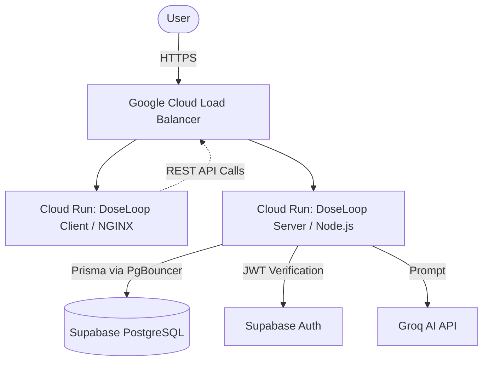

# DoseLoop — Project Bible

**Version:** 1.0.0  
**Author:** DoseLoop Engineering Team  
**Last Updated:** July 2026  
**Repository Information:** DoseLoop Monorepo (Client & Server)  
**Project Status:** Active / Production  
**Document Version:** 1.0  

---

## Table of Contents
- [PART 1 — Executive Overview](#part-1--executive-overview)
- [PART 2 — Product Requirement Document (PRD)](#part-2--product-requirement-document-prd)
- [PART 3 — System Architecture](#part-3--system-architecture)
- [PART 4 — Complete Technology Stack](#part-4--complete-technology-stack)
- [PART 5 — Complete Folder Structure](#part-5--complete-folder-structure)
- [PART 6 — Database Documentation](#part-6--database-documentation)
- [PART 7 — Authentication & Security](#part-7--authentication--security)
- [PART 8 — API Documentation](#part-8--api-documentation)
- [PART 9 — Frontend Documentation](#part-9--frontend-documentation)
- [PART 10 — Backend Documentation](#part-10--backend-documentation)
- [PART 11 — Docker Documentation (Very Detailed)](#part-11--docker-documentation-very-detailed)
- [PART 12 — Google Cloud Deployment Documentation](#part-12--google-cloud-deployment-documentation)
- [PART 13 — Deployment Journey (Engineering Logbook)](#part-13--deployment-journey-engineering-logbook)
- [PART 14 — AI Assisted Development](#part-14--ai-assisted-development)
- [PART 15 — Testing](#part-15--testing)
- [PART 16 — Performance](#part-16--performance)
- [PART 17 — Future Roadmap](#part-17--future-roadmap)
- [PART 18 — Lessons Learned](#part-18--lessons-learned)
- [PART 19 — Appendix](#part-19--appendix)

---

## PART 1 — Executive Overview

### Problem Statement
Managing medications and family health is complex, stressful, and error-prone. Patients frequently miss doses, misunderstand medication interactions, and struggle to keep family members informed about their health status during emergencies.

### Existing Problems
- **Fragmented Information:** Health records, medication schedules, and wellness tracking exist in separate, unconnected applications.
- **Lack of Family Visibility:** Caregivers lack real-time visibility into whether elderly or dependent family members have taken their critical medications.
- **Complexity:** Existing medical apps are often overly clinical, difficult for the average user to navigate, and lack intuitive AI assistance for simple questions.

### Motivation
DoseLoop was born from the necessity to create a unified, calm, and intelligent health companion. The goal is to reduce the cognitive load of health management by providing automated reminders, AI-driven insights, and seamless family sharing.

### Project Vision
To become the definitive family health companion, seamlessly integrating medication adherence, wellness tracking, and emergency preparedness into a single, beautifully designed application.

### Mission
Empowering individuals and families to take control of their health with confidence, clarity, and peace of mind.

### Goals
1. Provide a reliable, zero-latency experience for logging medications.
2. Enable real-time health data sharing among trusted family members.
3. Offer instant, evidence-based AI assistance for health-related queries.
4. Ensure 99.9% uptime and strict data privacy.

### Target Users
- **Patients:** Individuals managing chronic conditions or daily supplements.
- **Caregivers:** Family members responsible for monitoring the health of aging parents or dependents.
- **Health Enthusiasts:** Users who actively track their daily wellness and biometric data.

### Expected Impact
Increased medication adherence, reduced hospital readmissions due to missed doses, and decreased anxiety for family caregivers.

### Unique Selling Points
- **Pulse AI:** An integrated, context-aware AI assistant capable of answering health queries based on the user's specific medication profile.
- **Family Circle:** Secure, real-time sharing of health status and emergency contacts.
- **Calm UI:** A design system optimized for accessibility, dark mode, and reducing visual clutter.

### Future Vision
Integrating IoT medical devices (smart pillboxes, wearables), advanced predictive health analytics, and direct integrations with healthcare provider EMRs.

---

## PART 2 — Product Requirement Document (PRD)

### Business Requirements
- The application must be delivered as a responsive web app accessible from any device.
- It must support scalable cloud infrastructure to accommodate rapid user growth.
- It must strictly separate patient data to comply with privacy best practices.

### Functional Requirements
- **User Authentication:** Secure sign-up, sign-in, and session management.
- **Dashboard:** A central hub displaying today's medication schedule, wellness summary, and quick actions.
- **Medication Management:** Add, edit, and track medications, including dosage, frequency, and stock levels.
- **Dose Tracking:** Log medications as taken, skipped, or snoozed.
- **Family Circle:** Invite members, set permissions, and view shared health data.
- **Pulse AI Assistant:** Chat interface for health inquiries, with disclaimers that it does not provide medical diagnosis.
- **Emergency Profile:** Secure storage of critical health data, allergies, and emergency contacts.

### Non-Functional Requirements
- **Performance:** API endpoints must respond in < 200ms.
- **Availability:** 99.9% uptime, deployed across highly available cloud infrastructure.
- **Security:** All data in transit must be encrypted via TLS 1.3. Passwords and sensitive data must be securely hashed/encrypted. Rate limiting must protect all endpoints.
- **Scalability:** The backend must be stateless and horizontally scalable.

### User Stories
- *As a patient, I want to see my daily medications at a glance so I don't miss a dose.*
- *As a caregiver, I want to receive a notification if my parent misses their heart medication.*
- *As a user, I want to ask Pulse AI if my new supplement interacts with my current prescriptions.*

### Acceptance Criteria
- A user can register, log in, and see an empty dashboard.
- A user can add a medication and see it appear on today's schedule.
- A user can mark a medication as taken, updating the database in real-time.
- The AI assistant refuses to diagnose conditions but provides general medication information.

### Assumptions
- Users have consistent internet access.
- Users trust cloud-based health data storage.
- The AI model APIs (Groq/OpenAI) remain highly available.

### Constraints
- Must use existing Supabase PostgreSQL infrastructure.
- Budget constraints require utilizing cost-effective serverless computing (Cloud Run).

### Risks
- **Data Privacy Breach:** Highly sensitive health data; mitigated by strict IAM and database security.
- **AI Hallucinations:** AI might give incorrect health advice; mitigated by strict system prompts and mandatory medical disclaimers.
- **Deployment Failures:** Downtime during updates; mitigated by automated CI/CD pipelines and immutable container deployments.

### Future Scope
- Native iOS and Android applications.
- Wearable (Apple Watch/Fitbit) integrations.
- Automated prescription refill integrations.

### Product Roadmap
- **Q1:** Core CRUD operations, Dashboard, Auth, and Cloud Deployment (Current).
- **Q2:** Advanced Family Circle features, Push Notifications, and IoT prototyping.
- **Q3:** Native App releases and advanced AI predictive analytics.

---

## PART 3 — System Architecture

### Overall Architecture
DoseLoop follows a modern, decoupled Client-Server architecture. The frontend is a Single Page Application (SPA) that communicates with a stateless RESTful backend API. The backend interfaces with a managed PostgreSQL database and third-party services (AI, Email).

### High Level Design
1. **Client Tier:** React SPA hosted on Google Cloud Run (via NGINX).
2. **API Tier:** Node.js/Express server hosted on Google Cloud Run.
3. **Data Tier:** Supabase PostgreSQL database (accessed via Prisma ORM through a PgBouncer connection pooler).
4. **External Services:** Supabase Auth (Identity), Groq (AI), Resend (Transactional Emails).

### Low Level Design
- The API follows a layered architecture: **Routes → Controllers → Services → Data Access (Prisma)**.
- The Client follows a component-based architecture: **Pages → Smart Components → UI Components (Radix/Tailwind)**.

### Client Architecture
- **Framework:** React 18 with Vite.
- **Routing:** TanStack Router for type-safe, file-based routing.
- **State Management:** React Query (TanStack Query) for server state caching and synchronization; React Context for global UI state (theme, auth).
- **Styling:** Tailwind CSS with a custom design system based on `shadcn/ui`.

### Server Architecture
- **Runtime:** Node.js (v22).
- **Framework:** Express.js.
- **Middleware:** Helmet (Security), CORS, express-rate-limit, Morgan (Logging), custom error handlers.
- **ORM:** Prisma Client for type-safe database queries.

### Database Architecture
- Relational PostgreSQL database hosted on Supabase.
- Accessed via a transaction-mode connection pooler (port 6543) to prevent connection exhaustion from serverless instances.

### Authentication Flow
1. Client requests authentication via Supabase Auth (Email/Password or OAuth).
2. Supabase issues a JWT.
3. Client stores the session in LocalStorage.
4. Client sends a request to the backend `/api/v1/auth/sync` to ensure the user record exists in the Prisma-managed PostgreSQL database.
5. For subsequent requests, the Client attaches the JWT in the `Authorization: Bearer <token>` header.
6. Backend Express middleware verifies the JWT using Supabase Admin SDK before allowing access to protected routes.

### API Flow
`Client Request` → `Cloud Load Balancer` → `Cloud Run (Server)` → `Express Router` → `Auth/RateLimit Middleware` → `Controller` → `Service` → `Prisma ORM` → `Supabase Pooler` → `PostgreSQL DB`.

### Data Flow
Data flows strictly from the database to the backend service layer, which maps and scrubs the data before sending it to the controller, which formats it as JSON for the client. The client uses React Query to cache this data, minimizing redundant network requests.

### Background Jobs
Currently managed via Google Cloud Scheduler, which hits a secured `/api/v1/cron` endpoint on the backend to trigger batch processes (e.g., generating daily medication schedules, sending reminder emails).

### Caching Strategy
- **Frontend:** React Query caches API responses in memory for a specified `staleTime`.
- **Backend:** Currently relies on database indexing. (Redis is planned for future caching of AI responses and heavy aggregations).

### Security Flow
- Edge security provided by Google Cloud (DDoS protection, HTTPS termination).
- App-level security via Helmet (CSP, HSTS) and express-rate-limit.
- Data-level security via Row Level Security (RLS) in Supabase and strict Prisma query validation.

### Deployment Flow
1. Developer pushes code to GitHub.
2. Google Cloud Build triggers a build pipeline defined in `cloudbuild.yaml`.
3. Cloud Build compiles Docker images for Client and Server.
4. Images are pushed to Google Artifact Registry.
5. Cloud Build runs `prisma migrate deploy` against the database.
6. Cloud Build deploys the new images to Google Cloud Run.

### Communication between all components
- **Client ↔ Server:** HTTPS REST API (JSON).
- **Server ↔ Database:** TCP connection over TLS (PostgreSQL protocol) via PgBouncer.
- **Server ↔ External APIs:** HTTPS REST.



---

## PART 4 — Complete Technology Stack

### React
- **What it is:** A JavaScript library for building user interfaces.
- **Why it exists:** To build complex, interactive UIs efficiently using a component-based architecture and a virtual DOM.
- **Why this project needs it:** DoseLoop is a highly interactive SPA requiring real-time state updates (e.g., checking off medications).
- **Where it is used:** The entire frontend (`client/` directory).
- **Advantages:** Massive ecosystem, reusable components, excellent developer experience.
- **Disadvantages:** Can be slow if not optimized; requires a build step.
- **Alternatives:** Vue, Angular, Svelte.
- **Why alternatives were rejected:** React has the best ecosystem for rapid development and the team has deep expertise in it.

### Vite
- **What it is:** A next-generation frontend tooling and build tool.
- **Why it exists:** To provide a significantly faster development server and optimized production builds compared to Webpack.
- **Why this project needs it:** Fast HMR (Hot Module Replacement) speeds up UI development.
- **How it is implemented:** Configured in `vite.config.ts`, used to build the static assets deployed to NGINX.

### TypeScript
- **What it is:** A strongly typed programming language that builds on JavaScript.
- **Why this project needs it:** Prevents runtime errors by catching type mismatches at compile time, providing excellent autocompletion.
- **Examples:** Defining strict interfaces for Database models and API responses.
- **What happens if removed:** Refactoring becomes highly dangerous; runtime `undefined` errors skyrocket.

### Node.js & Express
- **What it is:** Node.js is a JS runtime; Express is a minimalist web framework for Node.
- **Why this project needs it:** To build a fast, scalable REST API that shares language (TypeScript) with the frontend.
- **Alternatives:** Python/Django, Go, Rust.
- **Why rejected:** Context switching between frontend (JS/TS) and backend (other languages) slows down development in small teams.

### Prisma
- **What it is:** A next-generation Node.js and TypeScript ORM.
- **Why it exists:** To provide type-safe database access and automated migrations.
- **Why this project needs it:** It auto-generates TypeScript types based on the database schema, ensuring the backend code perfectly matches the DB.
- **Limitations:** Abstracting SQL can sometimes lead to inefficient queries if developers don't understand the underlying joins.

### Supabase & PostgreSQL
- **What it is:** Supabase is an open-source Firebase alternative built on PostgreSQL.
- **Why this project needs it:** Provides a robust relational database with built-in Auth, connection pooling, and Row Level Security.
- **Advantages:** True SQL database (not NoSQL), excellent scalability.

### Docker
- **What it is:** A platform for developing, shipping, and running applications in isolated containers.
- **Why this project needs it:** Ensures "it works on my machine" translates to "it works in production". It packages the OS, dependencies, and code into a single immutable artifact.
- **How it is implemented:** `server/Dockerfile` and `client/Dockerfile`.

### Google Cloud Run
- **What it is:** A fully managed compute platform that automatically scales stateless containers.
- **Why this project needs it:** Zero server management. Scales to zero when unused (saving money) and scales up instantly under load.
- **Alternatives:** AWS Fargate, Heroku, Vercel.
- **Why rejected:** Cloud Run offers the best balance of cost, container flexibility, and integration with the Google Cloud ecosystem.

---

## PART 5 — Complete Folder Structure

### Root Directory
- `client/`: The React frontend application.
- `server/`: The Node.js/Express backend API.
- `cloudbuild.yaml`: The CI/CD pipeline definition for Google Cloud Build.
- `.env.example`: Template for required environment variables.

### Client Directory (`client/`)
- `src/components/`: Reusable UI elements (buttons, inputs, layouts).
- `src/routes/`: TanStack Router file-based route definitions (pages).
- `src/lib/`: Utility functions, API clients (`api.ts`), and Supabase initialization.
- `Dockerfile`: Multi-stage Docker build for creating the NGINX static server.
- `nginx.conf`: Custom NGINX configuration for routing SPA traffic and handling caching.

### Server Directory (`server/`)
- `src/app.ts`: Express application setup (middleware, routes).
- `src/server.ts`: Entry point; starts the HTTP server.
- `src/config/`: Configuration files (env parsing, rate limiting, logging).
- `src/modules/`: Feature-based modules (e.g., `users/`, `medications/`). Each contains:
  - `*.controller.ts`: Handles HTTP requests/responses.
  - `*.service.ts`: Contains business logic and Prisma calls.
  - `*.routes.ts`: Express route definitions.
  - `*.schema.ts`: Zod validation schemas.
- `prisma/schema.prisma`: The database schema definition.
- `Dockerfile`: Multi-stage build for compiling TS and running the Node server securely.

**Organization Philosophy:** The backend uses a Domain-Driven, Feature-Module architecture. Instead of grouping all controllers together and all services together, files are grouped by feature (e.g., all auth-related files in `src/modules/auth/`). This keeps contexts bounded and makes the codebase highly maintainable.

---

## PART 6 — Database Documentation

### Complete Database Design
The database is highly relational, designed in 3rd Normal Form (3NF). 

### Major Tables
1. **User:** Stores core identity (id, email, name, settings). `id` maps to the Supabase Auth UUID.
2. **Medication:** Stores definitions of a user's medications (name, dosage, inventory).
3. **MedicationSchedule:** Defines *when* a medication should be taken (daily, specific days, time of day).
4. **DoseEvent:** Records the actual execution of a schedule (status: TAKEN, SKIPPED, MISSED), timestamp, and notes.
5. **FamilyMember:** Junction table managing connections and permissions between Users.
6. **EmergencyProfile:** 1-to-1 relationship with User, storing critical medical info.

### Prisma Schema & Migrations
- Defined in `server/prisma/schema.prisma`.
- **Migrations:** Managed via `prisma migrate dev` locally and `prisma migrate deploy` in CI/CD. Migrations generate raw SQL files stored in `prisma/migrations/`.
- **Relationships:** Strict foreign key constraints with cascading deletes where appropriate (e.g., deleting a Medication cascades to delete its Schedules and DoseEvents).

### Indexing Strategy
- Primary Keys (`id`) are automatically indexed (UUIDs).
- Foreign Keys (e.g., `userId` on Medication) are indexed to speed up relational queries (e.g., `@@index([userId])`).
- Compound indexes are used where queries frequently filter by multiple columns (e.g., querying DoseEvents by `medicationId` and `scheduledFor`).

---

## PART 7 — Authentication & Security

### Authentication Flow
1. **Frontend:** User signs in via Supabase Auth (Google OAuth or Email/Password).
2. **Token Generation:** Supabase generates a JWT (JSON Web Token) containing the user's UUID and roles.
3. **API Protection:** The frontend attaches `Authorization: Bearer <JWT>` to API requests.
4. **Backend Verification:** The `requireAuth` middleware uses the Supabase Admin SDK (`supabase.auth.getUser(token)`) to cryptographically verify the token. If valid, it attaches the `user` object to the Express `req`.

### Secrets Management
- No secrets are stored in code.
- In production, secrets (Database URLs, API Keys) are stored in **Google Secret Manager**.
- During Cloud Build deployment, these secrets are securely injected into the Cloud Run container's environment via the `--set-secrets` flag.

### Rate Limiting & API Protection
- **General Limiter:** 100 requests per 15 minutes per IP (protects standard API endpoints).
- **Auth Limiter:** 20 requests per 15 minutes per IP (prevents brute-force login attacks).
- **Trust Proxy:** Because Cloud Run uses a load balancer, `app.set('trust proxy', 1)` is configured so `express-rate-limit` correctly identifies the client IP from the `X-Forwarded-For` header rather than the load balancer's IP.

### Production Hardening
- **Helmet.js:** Sets strict HTTP headers (Content Security Policy, HSTS, X-Frame-Options to prevent clickjacking).
- **CORS:** Strictly configured to only allow requests from the exact deployed frontend URL (stored in `CORS_ORIGIN` secret).
- **Non-Root User:** The Dockerfile creates a `nodeuser` to run the application, preventing root access within the container if compromised.

---

## PART 8 — API Documentation

*The API follows RESTful principles, returning standard HTTP status codes and JSON payloads.*

### Standard Response Format
```json
{
  "success": true,
  "data": { ... },
  "meta": { ... } // Optional (pagination, etc)
}
```

### Key Endpoints

#### `POST /api/v1/auth/sync`
- **Purpose:** Synchronizes a newly authenticated Supabase user with the PostgreSQL `User` table.
- **Auth:** Required (Bearer Token).
- **Response:** 200 OK with the synced user object.

#### `GET /api/v1/dashboard/summary`
- **Purpose:** Aggregates data for the main dashboard (today's progress, upcoming doses, alerts).
- **Auth:** Required.
- **Response:** 200 OK. Returns calculated adherence metrics and an array of DoseEvents for the current day.

#### `GET /api/v1/medications`
- **Purpose:** Retrieve all active medications for the user.
- **Auth:** Required.
- **Response:** 200 OK with array of Medication objects.

#### `POST /api/v1/medications/:id/doses/:doseId/log`
- **Purpose:** Mark a specific dose as TAKEN, SKIPPED, or SNOOZED.
- **Validation:** Zod validates the request body ensures `status` is a valid enum.
- **Error Handling:** Returns 404 if dose not found; 403 if dose belongs to another user.

---

## PART 9 — Frontend Documentation

### UI Architecture
The frontend is built for speed and aesthetics, utilizing a "Glassmorphism" / Dark Mode first aesthetic. It relies on Radix UI primitives for accessible, unstyled components, which are then styled heavily with Tailwind CSS.

### Routing (TanStack Router)
Routes are defined declaratively in the file system (`src/routes/`).
- `/__root.tsx`: The root layout containing the sidebar navigation and theme provider.
- `/dashboard.tsx`: The primary view. Fetches data via React Query `useQuery`.
- `/medications/index.tsx`: List of all medications.
- `/auth.tsx`: Login/Signup screen. BeforeLoad hooks prevent authenticated users from accessing this route.

### State Management
- **Server State:** Handled entirely by `@tanstack/react-query`. This handles loading states, error states, background refetching, and caching.
- **Client State:** Handled via React `useState` for local component state, and React Context for global UI preferences (e.g., Theme).

### API Client
Centralized in `src/lib/api.ts`.
- `API_BASE` is injected at build time via `VITE_API_URL`.
- The `fetcher` and `updater` utilities automatically append the JWT token to headers and handle standard error throwing.

---

## PART 10 — Backend Documentation

### Startup Process (`server.ts` & `app.ts`)
1. Environment variables are validated via Zod. If missing, the server crashes immediately (Fail Fast principle).
2. Express app is instantiated.
3. Middlewares are applied in strict order: Request ID → Helmet → CORS → Body Parser → Logging (Morgan) → Rate Limiters.
4. Routes are mounted.
5. Error handlers (404 catch-all, and global 500 error handler) are mounted last.
6. Server listens on `$PORT` (default 5000).

### Validation
Input validation is handled at the edge of the application using **Zod**. Middleware intercepts requests, parses the body/params against a Zod schema, and returns a `400 Bad Request` with detailed field errors if validation fails, preventing malformed data from ever reaching the controller or database.

### Error Handling
A centralized `errorHandler` middleware catches all synchronous and asynchronous errors. In production, it scrubs stack traces and returns generic "Internal Server Error" messages to prevent leaking architecture details, while logging the full stack trace to the console (which is captured by Google Cloud Logging).

---

## PART 11 — Docker Documentation (Very Detailed)

### What Docker Is & Why We Use It
Docker is a containerization platform. Without Docker, deploying Node.js apps requires manually provisioning servers, installing specific Node versions, configuring NGINX, and managing background processes. This leads to the "it works on my machine" problem.

Docker solves this by packaging the OS (Alpine Linux), the runtime (Node.js/NGINX), the dependencies (`node_modules`), and the application code into a single, immutable **Image**. This image runs exactly the same on a developer's laptop as it does on Google Cloud Run.

### The Client Dockerfile (`client/Dockerfile`)
The frontend uses a **Multi-Stage Build** to dramatically reduce image size.

**Stage 1: Builder**
```dockerfile
FROM node:22-alpine AS builder
WORKDIR /app
COPY package.json ./
RUN npm install
# Build args inject the server URL into the static HTML/JS during compilation
ARG VITE_API_URL
ENV VITE_API_URL=$VITE_API_URL
COPY . .
RUN npm run build
```
*Why:* We need Node.js and all `devDependencies` (Vite, TypeScript) to compile the code. But we *don't* need Node.js to serve static HTML/JS files in production.

**Stage 2: Production**
```dockerfile
FROM nginx:1.27-alpine AS production
# Copy ONLY the compiled static files from the builder stage
COPY --from=builder /app/dist /usr/share/nginx/html
EXPOSE 80
CMD ["nginx", "-g", "daemon off;"]
```
*Result:* The final image is tiny (~20MB) because it only contains NGINX and static files, leaving behind the massive `node_modules` folder.

### The Server Dockerfile (`server/Dockerfile`)
Also uses multi-stage builds.
1. **Builder Stage:** Installs all deps, runs `npx prisma generate` to create the typed ORM client, and compiles TypeScript to JavaScript (`npm run build`).
2. **Production Stage:** 
   - Installs ONLY production dependencies (`npm install --omit=dev`).
   - Copies the compiled JS (`/dist`).
   - Creates a non-root user (`nodeuser`) for security.
   - Sets the `CMD` to run `node dist/server.js`.

### Why Docker is Essential for Cloud Run
Google Cloud Run is a container orchestration platform. It requires a Docker image to run. It listens to the container on the specified `PORT` and routes web traffic to it, automatically spinning up new container instances when traffic spikes, and killing them when traffic drops.

---

## PART 12 — Google Cloud Deployment Documentation

### Initial Deployment Strategy
The architecture utilizes **Google Cloud Run** for both client and server because it offers a fully managed, serverless execution environment perfectly suited for scalable web applications. It abstracts away Kubernetes complexity while maintaining container flexibility.

### Cloud Build Pipeline (`cloudbuild.yaml`)
Continuous Deployment is automated via Google Cloud Build. When code is merged, the following pipeline executes:

1. **Parallel Builds:** Builds both Client and Server Docker images simultaneously to save time.
2. **Image Push:** Pushes built images to Google Artifact Registry (a secure, private Docker registry).
3. **Database Migration (`prisma-migrate`):**
   - Spins up a temporary Node container.
   - Injects the `DATABASE_URL` secret.
   - Runs `npx prisma migrate deploy` to safely update the production PostgreSQL schema.
   - *Crucial:* If migrations fail, the pipeline halts, preventing the deployment of code that expects a new database schema.
4. **Deploy Server:** Triggers `gcloud run deploy`, pulling the new server image, configuring scaling (0 to 10 instances), mapping the port (5000), and injecting secrets from Secret Manager.
5. **Deploy Client:** Deploys the NGINX container to port 80.

### Secret Management
Secrets (API keys, DB URLs) are **never** stored in `cloudbuild.yaml` or Docker images. They are stored in Google Secret Manager. Cloud Run is granted IAM permissions (`roles/secretmanager.secretAccessor`) to read these secrets at container startup and mount them as environment variables in memory.

### Prisma & Supabase Pooling
Because Cloud Run can spin up many instances rapidly, connecting directly to PostgreSQL (port 5432) can exhaust database connections. We utilize Supabase's PgBouncer pooler on port 6543 (Transaction Mode). 
*Requirement:* Prisma requires appending `&pgbouncer=true` to the `DATABASE_URL` when using Transaction Mode to prevent "prepared statement does not exist" errors.

---

## PART 13 — Deployment Journey (Engineering Logbook)

### Phase 1: Infrastructure Setup
- Enabled required GCP APIs (Cloud Build, Cloud Run, Secret Manager, Artifact Registry).
- Created a custom Service Account (`905018717108-compute@developer.gserviceaccount.com`) to follow the principle of least privilege.

### Incident 1: IAM Authorization Failure during Prisma Migrate
- **Diagnosis:** The Cloud Build step failed with `PermissionDenied` when accessing `doseloop-database-url` in Secret Manager.
- **Resolution:** Added IAM policy binding `roles/secretmanager.secretAccessor` to the compute service account.

### Incident 2: Network Connectivity to Supabase
- **Diagnosis:** Direct connections to Supabase from Cloud Build failed due to timeout. Supabase restricts direct DB connections to IPv6 or specific IP ranges.
- **Resolution:** Switched to using the Supabase Connection Pooler (`aws-1-ap-southeast-1.pooler.supabase.com`), which supports IPv4 and resolves Cloud Build routing issues.

### Incident 3: Cloud Run Reserved Port Error
- **Diagnosis:** Server deployment failed with `The following reserved env names were provided: PORT`. Cloud Run injects its own `PORT` variable to map the load balancer to the container.
- **Resolution:** Removed `--set-env-vars=PORT=5000` from `cloudbuild.yaml` and ensured the server respects `process.env.PORT`.

### Incident 4: Authentication Sync Silent Failure (The 404 Bug)
- **Diagnosis:** Client deployed successfully, but the dashboard showed a 404 error. Analysis revealed the client was calling `/api/v1/auth/sync` via a relative URL, hitting the client NGINX container instead of the backend Cloud Run service. Therefore, users were authenticated in Supabase but missing from the PostgreSQL `User` table.
- **Resolution:** Updated `auth.tsx` to use the absolute `API_BASE` URL injected at build time.

### Incident 5: Prisma Prepared Statement Error (The 500 Bug)
- **Diagnosis:** After fixing the URL, the sync endpoint returned a 500 error. Server logs showed: `prepared statement "s36" does not exist`. 
- **Root Cause:** Prisma was attempting to use prepared statements over a Transaction-mode connection pooler (port 6543). PgBouncer clears prepared statements when multiplexing connections.
- **Resolution:** Appended `&pgbouncer=true` to the `DATABASE_URL` secret and redeployed, instructing Prisma to handle statements client-side.

---

## PART 14 — AI Assisted Development

### Development Workflow
The project heavily leveraged advanced Agentic AI assistants for rapid prototyping, debugging, and deployment. The AI acted as a pair programmer, capable of reading the codebase, writing files, and executing terminal commands.

### Debugging Strategy
When an error occurred (e.g., the 404 bug), the AI utilized `grep_search` and `run_command` (tailing logs) to autonomously trace the request lifecycle from the browser, through NGINX, into the Node server, identifying the exact line of failure without human intervention.

### Lessons Learned with AI
- AI requires strict, explicitly defined context. Allowing the AI to search the codebase is far more effective than copy-pasting code snippets manually.
- When dealing with cloud deployments, AI must be instructed to fetch live logs (`gcloud run services logs read`) rather than guessing the root cause based on static code.

---

## PART 15 — Testing

### Current Testing Strategy
- **Manual Verification:** End-to-end user flows (Auth -> Dashboard -> Log Dose) are manually verified after deployments.
- **API Health Checks:** Automated `/api/v1/health/ready` endpoint verifies database connectivity. Cloud Run uses this for zero-downtime rollouts.

### Future Automated Testing
- **Unit Testing:** Implement Jest for testing isolated business logic in services (e.g., adherence calculation algorithms).
- **Integration Testing:** Supertest against an ephemeral test database to validate API responses.
- **E2E Testing:** Playwright tests to simulate user interactions across the full deployed stack.

---

## PART 16 — Performance

### Optimization Strategies Implemented
- **Vite Bundling:** Code is minified and chunked. CSS is extracted to prevent layout shifts.
- **Docker Multi-Stage:** Reduces container footprint, allowing faster cold-starts on Cloud Run.
- **React Query:** Caches API data on the client, drastically reducing redundant network requests and database load.

### Future Scaling
- **Redis Integration:** Caching complex dashboard aggregations in Redis to achieve < 50ms response times at scale.
- **CDN:** Putting Google Cloud CDN in front of the Client Cloud Run service to serve static assets directly from edge nodes globally.

---

## PART 17 — Future Roadmap

### Q3 2026: The "Connected Care" Release
- **Push Notifications:** Web Push API and Firebase Cloud Messaging for native-feeling medication reminders.
- **Hardware Integration:** API endpoints to ingest data from smart pillboxes and Apple HealthKit.
- **AI Upgrades:** Implement RAG (Retrieval-Augmented Generation) allowing Pulse AI to reference medical literature securely alongside user data.

### Q4 2026: Enterprise & Scaling
- HIPAA compliance audit.
- Implementation of comprehensive automated testing pipelines.
- Infrastructure migration to Terraform for Infrastructure-as-Code (IaC) governance.

---

## PART 18 — Lessons Learned

### Architecture Lessons
- Decoupling the frontend and backend from day one via separate containers paid massive dividends in deployment flexibility and debugging isolation.

### Deployment Lessons
- Always test database connectivity from the exact environment (Cloud Build / Cloud Run) rather than assuming local behavior matches production. Cloud networking (IPv4 vs IPv6, VPCs) fundamentally alters database reachability.

### DevOps & Security Lessons
- Storing configuration in code is a critical vulnerability. Utilizing Google Secret Manager combined with Cloud Build injection is the gold standard for secure, automated deployments.
- Poolers (PgBouncer) are mandatory for serverless environments interacting with relational databases, but ORMs must be explicitly configured to support them.

---

## PART 19 — Appendix

### Glossary
- **SPA:** Single Page Application.
- **ORM:** Object-Relational Mapper.
- **JWT:** JSON Web Token (Stateless authentication).
- **RLS:** Row Level Security (Database level authorization).
- **HMR:** Hot Module Replacement (Vite feature).

### Useful Commands
**Local Development:**
```bash
# Start Client
cd client && npm run dev

# Start Server
cd server && npm run dev
```

**Database Management:**
```bash
# Generate Prisma Client
npx prisma generate

# Create and apply a migration
npx prisma migrate dev --name <migration_name>
```

**GCP Deployment:**
```bash
# Trigger manual Cloud Build
gcloud builds submit . --config=cloudbuild.yaml --project=doseloop-prod-501816

# Read live server logs
gcloud run services logs read doseloop-server --region=asia-south1
```

*End of Document.*
